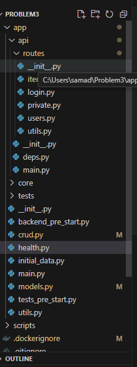

# FastAPI Project - Development

## Requirements

* [Docker](https://www.docker.com/).
* [Poetry](https://python-poetry.org/) for Python package and environment management.

The tech stack used
## Technology Stack and Features

- ⚡ [**FastAPI**](https://fastapi.tiangolo.com) for the Python backend API.
    - 🧰 [SQLModel](https://sqlmodel.tiangolo.com) for the Python SQL database interactions (ORM).
    - 🔍 [Pydantic](https://docs.pydantic.dev), used by FastAPI, for the data validation and settings management.
    - 💾 [PostgreSQL](https://www.postgresql.org) as the SQL database.
     🐋 [Docker Compose](https://www.docker.com) for development and production.
    - 🔒 Secure password hashing by default.
    - 🔑 JWT (JSON Web Token) authentication.
    - 📫 Email based password recovery.

Performm all the features as aked in the problem statement.


Additinal features that have been implemented- prioritisation of the tasks according to the priority level set in the models file


Task proritization based on class PriorityLevel(str, Enum):
    HIGH = "high"
    MEDIUM = "medium"
    LOW = "low"

    The folder structure looks like this-
T


## Project Structure 📁
```
PROBLEM3/
PROBLEM3/
├── app/
│   ├── api/
│   │   └── routes/
│   │       ├── __init__.py 
│   │       ├── items.py ## all the api end points have been done here
│   │       ├── login.py # logged in user password reset , register user ,reset password token based authentication has been implemneted here
│   │       ├── private.py # creating private users
│   │       ├── users.py # all the crud operations in terms of the user has been used
│   │       └── utils.py
│   ├── __init__.py
│   ├── deps.py # Database Session Management,OAuth2 Setup,Current User Authentication,Superuser Check, superuser privileges
│   ├── main.py
│   └── core/
│       ├── config.py #CORS (Cross-Origin Resource Sharing) Configuration,Handles CORS origins ,Validates URLs for CORS
│       ├── db.py # initializes the DB
│       └── security.py
├── tests/
│   ├── api/
│   ├── crud/
│   ├── scripts/
│   ├── utils/
│   ├── __init__.py
│   └── conftest.py
├── __init__.py
├── backend_pre_start.py # initializing  the DB with logging
├── crud.py - ## all the functions for achieving the crud features has been written here
├── health.py # t0 check the health of the DB
├── initial_data.py # creating initial data
├── main.py # starting point of the app
├── models.py ##  all the pydantic Base models have been implemented here
├── tests_pre_start.py # starting of the tests
├── utils.py
├── scripts/
├── .dockerignore # files to be ignored by Docker
├── .gitignore # the files to be ignored by git
├── Dockerfile # for containerisation
├── image.png
├── prestart.sh
├── pyproject.toml #python dependencies
├── README.md
├── README.MD
└── tests-start.sh

 
 the formatting has been done in rust
# all the required code has been written in


## Docker Compose

* Start the local stack with Docker Compose:

```bash
docker compose watch
```

* Now you can open your browser and interact with these URLs:

Frontend, built with Docker, with routes handled based on the path: http://localhost:5173

Backend, JSON based web API based on OpenAPI: http://localhost:8000

Automatic interactive documentation with Swagger UI (from the OpenAPI backend): http://localhost:8000/docs

Adminer, database web administration: http://localhost:8080

Traefik UI, to see how the routes are being handled by the proxy: http://localhost:8090

**Note**: The first time you start your stack, it might take a minute for it to be ready. While the backend waits for the database to be ready and configures everything. You can check the logs to monitor it.

To check the logs, run (in another terminal):

```bash
docker compose logs
```

To check the logs of a specific service, add the name of the service, e.g.:

```bash
docker compose logs backend
```

## Local Development

The Docker Compose files are configured so that each of the services is available in a different port in `localhost`.


This way, you could turn off a Docker Compose service and start its local development service, and everything would keep working, because it all uses the same ports.


```

Or you could stop the `backend` Docker Compose service:

```bash
docker compose stop backend
```

And then you can run the local development server for the backend:

```bash
cd backend
fastapi dev app/main.py
```


## Docker Compose files and env vars

There is a main `docker-compose.yml` file with all the configurations that apply to the whole stack, it is used automatically by `docker compose`.

And there's also a `docker-compose.override.yml` with overrides for development, for example to mount the source code as a volume. It is used automatically by `docker compose` to apply overrides on top of `docker-compose.yml`.

These Docker Compose files use the `.env` file containing configurations to be injected as environment variables in the containers.

They also use some additional configurations taken from environment variables set in the scripts before calling the `docker compose` command.

After changing variables, make sure you restart the stack:

```bash
docker compose watch
```

## The .env file

The `.env` file is the one that contains all your configurations, generated keys and passwords, etc.

Depending on your workflow, you could want to exclude it from Git, for example if your project is public. In that case, you would have to make sure to set up a way for your CI tools to obtain it while building or deploying your project.

One way to do it could be to add each environment variable to your CI/CD system, and updating the `docker-compose.yml` file to read that specific env var instead of reading the `.env` file.

## Pre-commits and code linting

we are using a tool called [pre-commit](https://pre-commit.com/) for code linting and formatting.

When you install it, it runs right before making a commit in git. This way it ensures that the code is consistent and formatted even before it is committed.

You can find a file `.pre-commit-config.yaml` with configurations at the root of the project.

#### Install pre-commit to run automatically

`pre-commit` is already part of the dependencies of the project, but you could also install it globally if you prefer to, following [the official pre-commit docs](https://pre-commit.com/).

After having the `pre-commit` tool installed and available, you need to "install" it in the local repository, so that it runs automatically before each commit.

Using `uv`, you could do it with:

```bash
❯ uv run pre-commit install
pre-commit installed at .git/hooks/pre-commit
```

Now whenever you try to commit, e.g. with:

```bash
git commit
```

...pre-commit will run and check and format the code you are about to commit, and will ask you to add that code (stage it) with git again before committing.

Then you can `git add` the modified/fixed files again and now you can commit.

#### Running pre-commit hooks manually

you can also run `pre-commit` manually on all the files, you can do it using `uv` with:

```bash
❯ uv run pre-commit run --all-files
check for added large files..............................................Passed
check toml...............................................................Passed
check yaml...............................................................Passed
ruff.....................................................................Passed
ruff-format..............................................................Passed
eslint...................................................................Passed
prettier.................................................................Passed
```

## URLs

The production or staging URLs would use these same paths, but with your own domain.

### Development URLs

Development URLs, for local development.

Backend: http://localhost:8000

Automatic Interactive Docs (Swagger UI): http://localhost:8000/docs

```bash
pip install fastapi-pagination
```

so repository pattern has een used to solve this