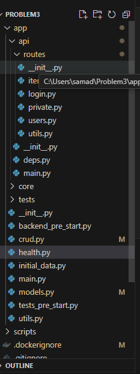

The tech stack used
## Technology Stack and Features

- ⚡ [**FastAPI**](https://fastapi.tiangolo.com) for the Python backend API.
    - 🧰 [SQLModel](https://sqlmodel.tiangolo.com) for the Python SQL database interactions (ORM).
    - 🔍 [Pydantic](https://docs.pydantic.dev), used by FastAPI, for the data validation and settings management.
    - 💾 [PostgreSQL](https://www.postgresql.org) as the SQL database.
     🐋 [Docker Compose](https://www.docker.com) for development and production.
    - 🔒 Secure password hashing by default.
    - 🔑 JWT (JSON Web Token) authentication.
    - 📫 Email based password recovery.

Performm all the features as aked in the problem statement.


Additinal features that have been implemented- prioritisation of the tasks according to the priority level set in the models file


Task proritization based on class PriorityLevel(str, Enum):
    HIGH = "high"
    MEDIUM = "medium"
    LOW = "low"

    The folder structure looks like this-
T


## Project Structure 📁
```
PROBLEM3/
PROBLEM3/
├── app/
│   ├── api/
│   │   └── routes/
│   │       ├── __init__.py 
│   │       ├── items.py ## all the api end points have been done here
│   │       ├── login.py # logged in user password reset , register user ,reset password token based authentication has been implemneted here
│   │       ├── private.py # creating private users
│   │       ├── users.py # all the crud operations in terms of the user has been used
│   │       └── utils.py
│   ├── __init__.py
│   ├── deps.py # Database Session Management,OAuth2 Setup,Current User Authentication,Superuser Check, superuser privileges
│   ├── main.py
│   └── core/
│       ├── config.py #CORS (Cross-Origin Resource Sharing) Configuration,Handles CORS origins ,Validates URLs for CORS
│       ├── db.py # initializes the DB
│       └── security.py
├── tests/
│   ├── api/
│   ├── crud/
│   ├── scripts/
│   ├── utils/
│   ├── __init__.py
│   └── conftest.py
├── __init__.py
├── backend_pre_start.py # initializing  the DB with logging
├── crud.py - ## all the functions for achieving the crud features has been written here
├── health.py # t0 check the health of the DB
├── initial_data.py # creating initial data
├── main.py # starting point of the app
├── models.py ##  all the pydantic Base models have been implemented here
├── tests_pre_start.py # starting of the tests
├── utils.py
├── scripts/
├── .dockerignore # files to be ignored by Docker
├── .gitignore # the files to be ignored by git
├── Dockerfile # for containerisation
├── image.png
├── prestart.sh
├── pyproject.toml #python dependencies
├── README.md
├── README.MD
└── tests-start.sh

# all the required code has been written in


